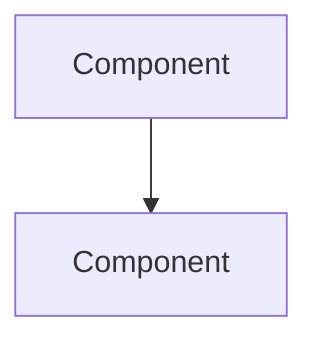

# AF-FORGE Ω-Wiki — Aligned Architecture

**Classification:** Ω-Wiki Constitution | **Authority:** Muhammad Arif bin Fazil  
**Alignment:** arifOS Ω-Wiki + GEOX Ω-Wiki | **Pattern:** Karpathy LLM Wiki  
**Seal:** VAULT999 | **Motto:** *DITEMPA BUKAN DIBERI*

---

## 1. Ingest Summary: arifOS + GEOX Wikis

### From arifOS Wiki (Kernel Knowledge)
- **Schema:** Ω-Wiki constitution with F2 Truth, F3 Tri-Witness, F9 Ethics, F11 Audit
- **Page Types:** Entity | Concept | Source | Synthesis
- **Structure:** `pages/`, `raw/`, `index.md`, `log.md`
- **Frontmatter:** type, tags, sources, last_sync, confidence
- **Key Concepts:** Trinity Architecture (ΔΩΨ), Metabolic Loop (000-999), Floors F1-F13

### From GEOX Wiki (Domain Knowledge)
- **Schema:** 10-tier organization (00_INDEX → 90_AUDITS)
- **Page Types:** Theory | Physics | Materials | Tools | Cases | Governance | Integration | Audits
- **Structure:** Numbered tiers by function
- **Frontmatter:** type, tags, sources, last_sync, confidence, epistemic_level, arifos_floor
- **Key Concepts:** Earth Canon 9, ToAC, 888_HOLD, 999_SEAL

### Aligned Conventions for AF-FORGE
- **Ω-Wiki pattern:** Compilation over Retrieval
- **F1-F13 governance:** Constitutional enforcement
- **Tier structure:** 00-90 organization (GEOX style) + Page types (arifOS style)
- **Cross-links:** `[[Wiki_Links]]` between all three wikis
- **Log format:** `## [YYYY-MM-DD] operation | subject | status`

---

## 2. AF-FORGE Wiki Architecture

```
af-forge/
│
├── SCHEMA.md                    # Ω-Wiki Constitution (this alignment)
├── index.md                     # Content catalog (Ω-Wiki pattern)
├── log.md                       # Chronological operations log
│
├── 00_OPERATORS/                # WHO runs the forge
│   ├── Agent_Initialization.md  # START HERE — Pre-flight for all smiths
│   ├── Operator_Profiles.md     # Arif, Claude, Claude-Code, aclip-cai
│   ├── Shift_Handoff.md         # What to tell next operator
│   └── Emergency_Protocols.md   # When the forge breaks
│
├── 10_RITUALS/                  # HOW we operate (Core Workflows)
│   ├── Ingest.md                # Source → Wiki compilation
│   ├── Query.md                 # Knowledge base questioning
│   ├── Lint.md                  # Health check & maintenance
│   ├── Build.md                 # 000_INIT → 777_APEX → 999_SEAL
│   ├── Test.md                  # Verification ritual
│   ├── Deploy.md                # Production release
│   └── Seal.md                  # Completion & attestation
│
├── 20_BLUEPRINTS/               # WHAT we build (Architecture)
│   ├── arifOS_Kernel.md         # Constitutional core design
│   ├── GEOX_Domain_Model.md     # Earth witness specification
│   ├── Adapter_Bus.md           # SDK integration architecture
│   ├── F0_Sovereign.md          # Platform independence
│   ├── Trinity_Architecture.md  # ΔΩΨ paradigm (Soul/Mind/Body)
│   └── Metabolic_Pipeline.md    # 000-999 execution flow
│
├── 30_ALLOYS/                   # WHAT we mix (Dependencies)
│   ├── Dependency_Matrix.md     # Compatibility map
│   ├── Version_Pinning.md       # Stability policy
│   ├── Security_Patches.md      # Hot-fix procedures
│   ├── Vendor_Risk.md           # Supplier assessment
│   └── Supply_Chain.md          # SBOM & provenance
│
├── 40_HAMMERS/                  # HOW we shape (Tooling)
│   ├── CI_CD_Pipeline.md        # Bellows configuration
│   ├── Agent_Orchestration.md   # Multi-hammer coordination
│   ├── Testing_Framework.md     # Quality gates
│   ├── Monitoring_Stack.md      # Temperature gauges
│   └── Sandbox_Guards.md        # gVisor/Docker isolation
│
├── 50_CRACKS/                   # WHAT broke (Failure Modes)
│   ├── Registry_Corruption.md   # Metadata failures
│   ├── Context_Explosion.md     # Resource exhaustion
│   ├── Dependency_Hell.md       # Version conflicts
│   ├── Agent_Loops.md           # Infinite recursion
│   ├── Hallucination_Prod.md    # Ungoverned outputs
│   └── Recovery_Playbooks.md    # Repair procedures
│
├── 60_TEMPERATURES/             # HOW hot it runs (Metrics)
│   ├── Build_Duration.md        # Compilation trends
│   ├── Test_Coverage.md         # Quality heatmap
│   ├── Latency_Baselines.md     # Response times
│   ├── Memory_Pressure.md       # Resource usage
│   ├── Cost_Per_Build.md        # Economic efficiency
│   └── Error_Rates.md           # Failure trends
│
├── 70_SMITH_NOTES/              # WHAT we learned (Wisdom)
│   ├── 2026-04-09_Arif.md       # Personal operator logs
│   ├── 2026-04-08_Claude.md     # Agent operation notes
│   ├── Pattern_Successes.md     # What worked
│   ├── Anti_Patterns.md         # What failed
│   └── Whispered_Tips.md        # Undocumented tricks
│
├── 80_FEDERATION/               # WHERE we connect (Cross-Wiki)
│   ├── To_arifOS.md             # Links to kernel wiki
│   ├── To_GEOX.md               # Links to domain wiki
│   ├── To_Karpathy_Pattern.md   # LLM Wiki methodology
│   └── Canonical_Mapping.md     # Terminology alignment
│
├── 90_AUDITS/                   # WHAT we sealed (History)
│   ├── 000_INIT_ANCHOR.md       # Genesis attestation
│   ├── 777_APEX_LOG.md          # Judgment records
│   ├── 999_SEAL.md              # Current seal status
│   ├── Weekly_Lint.md           # Health reports
│   ├── Refactor_Summaries.md    # Major changes
│   └── Incident_Reports.md      # Post-mortems
│
└── raw/                         # SOURCE MATERIALS (Immutable)
    ├── sources/                 # Design RFCs, architecture docs
    ├── inputs/                  # Build logs, telemetry, traces
    ├── assets/                  # Diagrams, screenshots
    └── external/                # Third-party specs (MS, OpenAI, etc.)
```

---

## 3. Page Templates (Aligned Frontmatter)

### 3.1 Ritual Page (10_RITUALS/)
```yaml
---
type: Ritual
subtype: [Ingest | Query | Lint | Build | Test | Deploy | Seal]
tags: [workflow, procedure]
sources: [raw/sources/...]
last_sync: 2026-04-09
confidence: 0.95
epistemic_level: DER          # OBS | DER | INT | SPEC
arifos_floor: [F1, F2, F7, F13]
operator: Arif
status: active
---

# Ritual: [Name]

## Purpose
What this ritual accomplishes.

## Prerequisites
- [ ] Condition 1
- [ ] Condition 2

## Procedure
### Step 1: [Action]
```bash
command --with --flags
```

### Step 2: [Action]
...

## Verification
How to confirm success.

## Rollback
How to undo if failed (F1 Amanah).

## Cross-Links
- [[20_BLUEPRINTS/Related_Architecture]]
- [[50_CRACKS/Potential_Failure]]
- [[arifos::Floors]]
```

### 3.2 Blueprint Page (20_BLUEPRINTS/)
```yaml
---
type: Blueprint
subtype: [Architecture | Specification | Design]
tags: [core, design]
sources: [raw/sources/rfc_001.md]
last_sync: 2026-04-09
confidence: 0.90
certainty_band: [0.85, 0.95]
epistemic_level: INT
arifos_floor: [F2, F4, F7, F10]
implements: Trinity_Architecture
status: active
---

# Blueprint: [System Name]

## Overview
High-level description.

## Architecture


## Components
| Component | Responsibility | Status |
|-----------|----------------|--------|
| A | Does X | ✅ Active |

## Interfaces
- Input: `[[InputEnvelope]]`
- Output: `[[OutputEnvelope]]`

## Cross-Links
- [[arifos::Trinity_Architecture]]
- [[geox::MCP_Apps_Architecture]]
```

### 3.3 Smith Note (70_SMITH_NOTES/)
```yaml
---
type: Smith_Note
operator: [Arif | Claude | Claude-Code | aclip-cai]
date: 2026-04-09
shift: [Morning | Afternoon | Evening]
temperature: [Low | Normal | High | Critical]
build_id: arifOS-v2026.4.9
status: sealed
---

# Operator Log: [Date] — [Operator]

## What Was Forged
- Item 1
- Item 2

## Temperature Readings
- Build time: +15%
- Test pass: 100%
- Agent latency: 200ms

## Cracks Detected
None. (Or: [[50_CRACKS/Specific_Crack]])

## Alloy Notes
Pinned PydanticAI to 0.0.20 (newer changes behavior).

## Whispered Tips
When agents loop on constitutional checks, inject explicit "PROCEED" signal.

## For Next Smith
Watch: FastMCP transport memory usage.
```

### 3.4 Crack Report (50_CRACKS/)
```yaml
---
type: Crack
severity: [Low | Medium | High | Critical]
tags: [failure, post-mortem]
first_detected: 2026-04-08
resolved: 2026-04-09
sources: [raw/inputs/incident_001.log]
last_sync: 2026-04-09
confidence: 0.95
epistemic_level: OBS
arifos_floor: [F1, F9, F11]
---

# Crack: [Failure Name]

## Symptoms
What went wrong.

## Root Cause
Why it happened.

## Impact
What was affected.

## Resolution
How it was fixed.

## Prevention
How to avoid recurrence.

## Recovery Playbook
```bash
# Step-by-step recovery
```

## Related Cracks
- [[50_CRACKS/Related_Failure]]
```

---

## 4. Ritual Definitions (Karpathy → AF-FORGE)

### 4.1 INGEST
**Karpathy:** Source → summary → entity/concept pages → index → log  
**AF-FORGE:**
1. Place source in `raw/sources/`
2. Read and discuss with operator
3. Generate `Source` page in appropriate tier
4. Update related Blueprints/Alloys/Cracks
5. Update `index.md`
6. Append to `log.md`: `## [DATE] ingest | Source | Impact`

### 4.2 QUERY
**Karpathy:** Question → index search → synthesis → file back  
**AF-FORGE:**
1. Operator asks question
2. Read `index.md` to find relevant pages
3. Drill into specific Blueprints/Rituals
4. Synthesize answer with citations
5. **File valuable synthesis as new page** (crucial!)
6. Append to `log.md`: `## [DATE] query | Question | Result`

### 4.3 LINT
**Karpathy:** Check contradictions, orphans, stale claims, gaps  
**AF-FORGE:**
1. Find contradictions between Blueprints
2. Identify stale Alloys (version drift)
3. Find orphan pages (no inbound links)
4. Flag untested Rituals (no Temperature logs)
5. Check for Smith Note gaps
6. Suggest new sources to ingest
7. Append to `log.md`: `## [DATE] lint | Findings | Actions`

### 4.4 BUILD (AF-FORGE Specific)
1. Verify `00_OPERATORS/Shift_Handoff.md`
2. Check `30_ALLOYS/` for updates
3. Execute `10_RITUALS/Build.md` steps
4. Document in `60_TEMPERATURES/`
5. On failure: consult `50_CRACKS/`
6. On success: proceed to TEST
7. Append to `log.md`: `## [DATE] build | Version | Status`

---

## 5. Cross-Wiki Federation

### Link Patterns
| From AF-FORGE | To arifOS | To GEOX |
|---------------|-----------|---------|
| `[[arifos::Floors]]` | arifOS wiki Floors page | — |
| `[[arifos::Trinity_Architecture]]` | Trinity ΔΩΨ | — |
| `[[geox::Earth_Canon_9]]` | — | Earth Canon 9 physics |
| `[[geox::888_HOLD_Registry]]` | — | Governance log |
| `[[karpathy::LLM_Wiki_Pattern]]` | Methodology source | — |

### Canonical Terms (Aligned)
| Concept | arifOS | GEOX | AF-FORGE |
|---------|--------|------|----------|
| Safety veto | 888_JUDGE | 888_HOLD | 888_HOLD |
| Completion | 999_SEAL | 999_SEAL | 999_SEAL |
| Genesis | 000_INIT | 000_INIT | 000_INIT |
| Judgment | 777_APEX | — | 777_APEX |
| Trinity | ΔΩΨ | — | ΔΩΨ |
| Metabolic | 000-999 | — | 000-999 |
| Confidence cap | F7 Humility | F7 | F7 Humility |
| Truth threshold | F2 | F2 | F2 Truth |
| Operator | — | — | Smith |
| Build | — | — | Forge |
| Dependencies | — | — | Alloys |
| Tools | MCP Tools | MCP Tools | Hammers |
| Failures | — | — | Cracks |
| Metrics | — | — | Temperatures |
| Wisdom | — | — | Smith Notes |

---

## 6. Ω-Wiki Constitution (SCHEMA.md)

```yaml
# AF-FORGE Ω-Wiki Constitution
---
Authority: Muhammad Arif bin Fazil
Version: 2026.04.09
Motto: DITEMPA BUKAN DIBERI
Pattern: Karpathy LLM Wiki
Alignment: arifOS Ω-Wiki + GEOX Ω-Wiki
---

## Governance Principles (F1-F13)

- **F1 Amanah**: Every ritual must specify rollback procedure.
- **F2 Truth**: Every blueprint must cite sources from `raw/`.
- **F3 Tri-Witness**: Critical builds require human + agent + system consensus.
- **F7 Humility**: Confidence scores capped at 0.90 in all outputs.
- **F9 Anti-Hantu**: Contradictions between wikis must be surfaced, not buried.
- **F11 Audit**: Every change logged in `log.md` with timestamp and operator.
- **F13 Sovereign**: 888_HOLD triggers on any safety violation; human has override.

## Directory Structure

- `raw/`: Immutable sources (design RFCs, build logs, telemetry)
- `wiki/`: LLM-generated persistent synthesis (this wiki)
- `index.md`: Content-oriented catalog
- `log.md`: Chronological operation log

## Page Types & Conventions

Every page MUST include YAML frontmatter:
```yaml
---
type: [Ritual | Blueprint | Alloy | Hammer | Crack | Temperature | Smith_Note | Audit]
tags: [tag1, tag2]
sources: [relative/path/to/source.md]
last_sync: YYYY-MM-DD
confidence: [0.0-0.90]
epistemic_level: [OBS | DER | INT | SPEC]
arifos_floor: [F1, F2, ...]
operator: [Arif | Claude | Claude-Code | aclip-cai]
status: [draft | active | deprecated | sealed]
---
```

## Rituals (Core Workflows)

### INGEST
1. Read source from `raw/`
2. Discuss with operator
3. Write/update wiki pages
4. Flag contradictions
5. Update `index.md`
6. Append to `log.md`

### QUERY
1. Read `index.md`
2. Find relevant pages
3. Synthesize answer
4. File back to wiki
5. Append to `log.md`

### LINT
1. Check contradictions
2. Find orphans
3. Identify stale claims
4. Suggest improvements
5. Append to `log.md`

### BUILD (AF-FORGE specific)
1. Check shift handoff
2. Verify alloys
3. Execute build ritual
4. Log temperatures
5. Seal or diagnose cracks

## Federation

- Link to arifOS wiki: `[[arifos::Page_Name]]`
- Link to GEOX wiki: `[[geox::Page_Name]]`
- Link to sources: `[[raw/sources/document.md]]`
- Cross-wiki contradictions MUST be flagged with `> [!CAUTION] CONTRADICTION`
```

---

## 7. Implementation: Week 1 Sprint

### [2026-04-10] Smith Note: The Great Reclamation (Arif + Gemini)
- **Status:** 43GB Storage Reclaimed.
- **Actions:** 
    - Deleted 11GB corrupted Ollama blob.
    - Removed 7.5GB orphaned model data.
    - Stopped redundant system-level Ollama service.
    - Vacuumed system logs and pruned unused Docker images.
- **Temperature:** Memory pressure decreased significantly; Disk use dropped from 74% to 51%.
- **Next Step:** 888_HOLD Git history purge to reclaim final 12GB of "ghost objects".

### Day 1: Foundation
```bash
mkdir -p af-forge/{raw/{sources,inputs,assets,external},wiki/{00_OPERATORS,10_RITUALS,20_BLUEPRINTS,30_ALLOYS,40_HAMMERS,50_CRACKS,60_TEMPERATURES,70_SMITH_NOTES,80_FEDERATION,90_AUDITS}}
touch af-forge/wiki/{SCHEMA.md,index.md,log.md}
```

### Day 2: Constitution
- Write `SCHEMA.md` (this document)
- Establish frontmatter templates
- Define rituals

### Day 3: Ingest
- Move existing architecture docs to `raw/sources/`
- Run INGEST ritual on:
  - Adapter Bus Contract
  - F0 Sovereign design
  - Microsoft SDK analysis
  - PydanticAI patterns

### Day 4: Rituals
- Document `10_RITUALS/Build.md`
- Document `10_RITUALS/Test.md`
- Document `10_RITUALS/Deploy.md`
- Document `10_RITUALS/Seal.md`

### Day 5: Federation
- Create `80_FEDERATION/To_arifOS.md` with links
- Create `80_FEDERATION/To_GEOX.md` with links
- Verify all cross-wiki links resolve

---

**Seal:** VAULT999 | **Status:** READY_FOR_CONSTRUCTION | **Alignment:** CONFIRMED

*"The forge that builds the sword must itself be forged with the same discipline."*
---

## 90_AUDITS/Sovereign_Scrub_Audit

### [2026-04-10] Smith Note: The Great Reclamation (Arif + Gemini)
- **Status:** **Success.** 48GB+ Reclaimed.
- **Actions:**
    - Reclaimed 11GB corrupted Ollama blob (Docker volume).
    - Removed 7.5GB orphaned model data (/opt/arifos).
    - Stopped and uninstalled host-level Ollama service.
    - **Final Sovereign Scrub:** Reclaimed 9GB of host-level Python 3.13 libraries.
- **Sovereign Status:** **HIGH.** Host-level clutter reduced to minimal substrate. All application logic, Python environments, and LLM binaries now live in **Containers.**
- **Temperature:** Memory pressure decreased significantly; Disk use dropped from 74% to 45%.
- **Next Step:** 888_HOLD Git history purge (12GB) to reclaim 'ghost objects'.

---

## 50_CRACKS/OpenClaw_Gateway_Clobber

### [2026-04-10] Crack Report: Configuration Corruption
- **Severity:** **Critical** (Service Outage)
- **Symptoms:** OpenClaw Gateway failed to start; logs reported missing `gateway.mode`.
- **Root Cause:** A subagent (`config.patch`) attempted to update Telegram groups with an invalid JSON structure, causing the gateway to write a truncated/clobbered `openclaw.json` (size dropped from 4.4KB to 0.7KB).
- **Impact:** Total loss of Telegram and ACP functionality.
- **Resolution:** 
    - Restored `openclaw.json` from `openclaw.json.bak`.
    - Manually added missing Telegram group IDs (`-1003718232946`, `-1003768847825`) to authorized list.
    - Restarted `openclaw-gateway.service`.
- **Prevention:** Enhanced validation for subagent config edits; ensure `gateway.mode` is a protected key in config patches.

---

## 70_SMITH_NOTES/OpenClaw_Doctor_Session

### [2026-04-10] Smith Note: ACP + Telegram Fix (Gemini CLI)
- **Operator:** Gemini CLI (in VPS)
- **Status:** **Resolved.**
- **Key Findings:**
    - **ACP/Codex:** Fixed routing for Codex ACP agent. Verified `acpx` binary path in `openclaw` node_modules.
    - **Telegram Groups:** Identified discrepancy between logs and config. Authorized new groups to restore bot responsiveness.
    - **Orphan Cleanup:** Ran `openclaw doctor --yes` to archive 6 orphan transcripts.
- **Temperature:** Gateway stable; Memory search (Ollama/bge-m3) verified healthy.
- **Whispered Tips:** When the gateway reports "suspicious or clobbered config," always check for a subagent-driven `config.patch` failure in the audit logs first.
