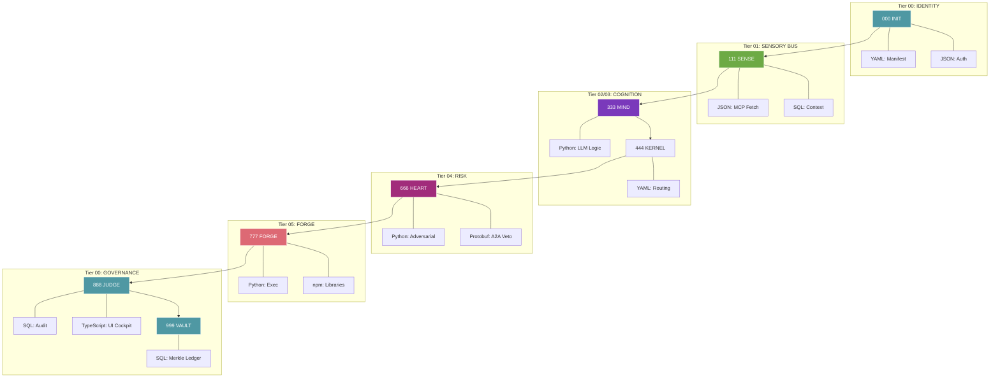

# arifOS v2.0 Canonical Diagrams

## 1. Substrate Pipeline (000→999)
Copy and paste this into your Notion Master Page.

```mermaid
graph TD
    subgraph T00_Identity [Tier 00: IDENTITY]
        S000[000 INIT] --- Y0[YAML: Manifest]
        S000 --- J0[JSON: Auth]
    end

    subgraph T01_Sensory [Tier 01: SENSORY BUS]
        S111[111 SENSE] --- J1[JSON: MCP Fetch]
        S111 --- Q1[SQL: Context]
    end

    subgraph T02_03_Cognition [Tier 02/03: COGNITION]
        S333[333 MIND] --- P3[Python: LLM Logic]
        S444[444 KERNEL] --- Y4[YAML: Routing]
    end

    subgraph T04_Risk [Tier 04: RISK]
        S666[666 HEART] --- P6[Python: Adversarial]
        S666 --- B6[Protobuf: A2A Veto]
    end

    subgraph T05_Forge [Tier 05: FORGE]
        S777[777 FORGE] --- P7[Python: Exec]
        S777 --- N7[npm: Libraries]
    end

    subgraph T00_Governance [Tier 00: GOVERNANCE]
        S888[888 JUDGE] --- Q8[SQL: Audit]
        S888 --- T8[TypeScript: UI Cockpit]
        S999[999 VAULT] --- Q9[SQL: Merkle Ledger]
    end

    S000 --> S111 --> S333 --> S444 --> S666 --> S777 --> S888 --> S999

    style S000 fill:#4f98a3,stroke:#fff,color:#fff
    style S111 fill:#6daa45,stroke:#fff,color:#fff
    style S333 fill:#7a39bb,stroke:#fff,color:#fff
    style S666 fill:#a12c7b,stroke:#fff,color:#fff
    style S777 fill:#dd6974,stroke:#fff,color:#fff
    style S888 fill:#4f98a3,stroke:#fff,color:#fff
    style S999 fill:#4f98a3,stroke:#fff,color:#fff
```

---
**⬡ DITEMPA BUKAN DIBERI — DIAGRAMS SEALED ⬡**
